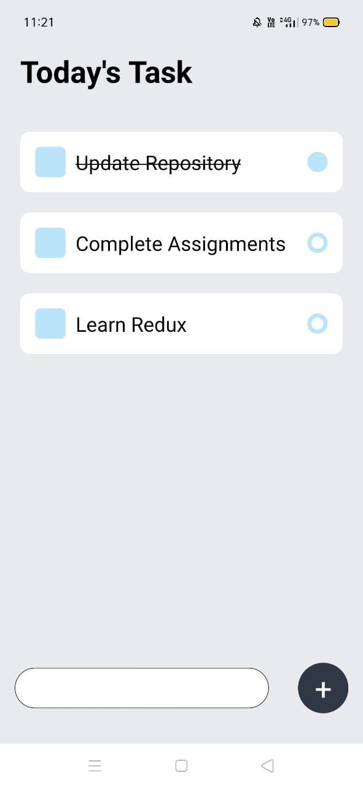

# DailyTask-ReactNative

<h2>Manage your Task App in React Native</h2>
Features:
<ul>
 <li> Mark as done </li>
 <li> Create Task </li>
 <li>  Delete Task </li>
 <li> Task Saved Offline using Async Storage </li>

  </ul>
  
   
